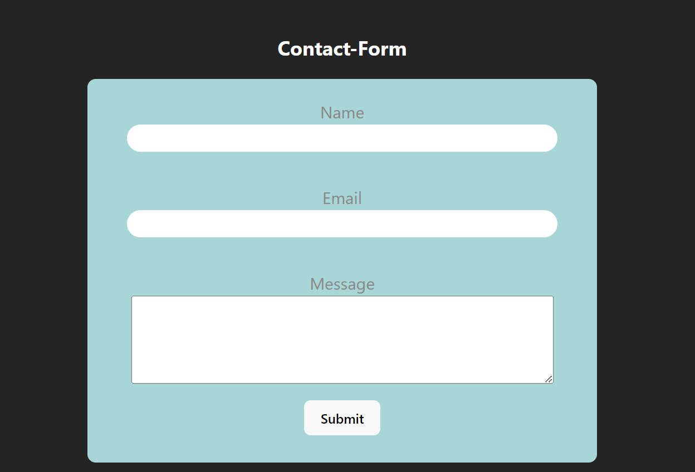

# 📬 Contact Form App

This is a full-stack contact form application built using React for the frontend, Express for the backend, and Mongoose for the database. The app allows users to submit their contact information, which is then stored in a MongoDB database. Form validation is handled using Formik and Yup, and Axios is used for making HTTP requests from the frontend to the backend. The CORS middleware is used to enable cross-origin requests.

- [📬 Contact Form App](#-contact-form-app)
  - [📑 Table of Contents](#-table-of-contents)
  - [🚀 Demo](#-demo)
  - [✨ Features](#-features)
  - [🛠️ Technologies Used](#-technologies-used)
  - [📦 Getting Started](#-getting-started)
    - [Prerequisites](#prerequisites)
    - [Installation](#installation)
    - [Running the App](#running-the-app)
  - [🛠️ API Endpoints](#-api-endpoints)
    - [POST /contact](#post-contact)
  - [📸 Screenshots](#-screenshots)
  - [🤝 Contributing](#-contributing)
  - [📝 License](#-license)

## 🚀 Demo

A live demo of the application can be found [here](#).

## ✨ Features

- User-friendly contact form
- Form validation with Formik and Yup
- Axios for making HTTP requests
- Express backend to handle API requests
- MongoDB database for storing contact information
- CORS enabled for cross-origin requests

## 🛠️ Technologies Used

- Frontend:
  - React
  - Formik
  - Yup
  - Axios

- Backend:
  - Express
  - Mongoose
  - Node.js
  - CORS

- Database:
  - MongoDB

## 📦 Getting Started

### Prerequisites

- Node.js and npm installed
- MongoDB installed and running

### Installation

1. Clone the repository:
   ```bash
   git clone https://github.com/md-faizan-khan61/contact-form-app.git
   cd contact-form-app

2. Install dependencies for both frontend and backend:
   ```bash
   # In the root directory
   npm install

   # Change to the client directory
   cd client
   npm install
   ```

### Running the App

1. Start the backend server:
   ```bash
   # In the root directory
   npm start
   ```

2. Start the frontend development server:
   ```bash
   # In the client directory
   cd client
   npm start
   ```

3. Open your browser and navigate to `http://localhost:3000`.


## 🛠️ API Endpoints

### POST /contact

- **Description**: Submit a contact form
- **Request Body**:
  ```json
  {
    "name": "John Doe",
    "email": "john.doe@example.com",
    "message": "Hello, this is a message."
  }
  ```

## 📸 Screenshot


## 🤝 Contributing

Contributions are welcome! Please open an issue or submit a pull request for any changes.

1. Fork the repository
2. Create your feature branch (`git checkout -b feature/AmazingFeature`)
3. Commit your changes (`git commit -m 'Add some AmazingFeature'`)
4. Push to the branch (`git push origin feature/AmazingFeature`)
5. Open a pull request

## 📝 License

This project is licensed under the MIT License.


